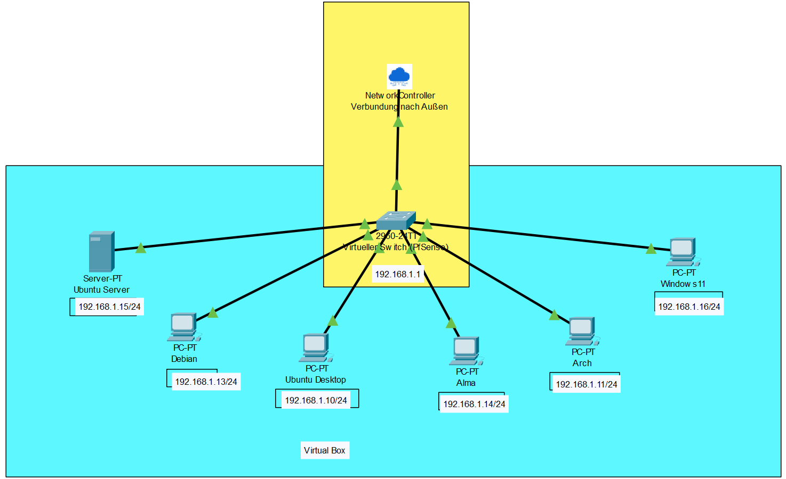

# Netzwerkdokumentation – Projekt 3

**Autorin:** Alexandra Schach  
**Titel:** Netzwerkdokumentation zu Projekt 3  
**Projekt:** Aufbau eines Heimnetzwerkes  
**Start:** 15.05.2025  
**Ende:**  

---

## Einleitung

Die Dokumentation eines Netzwerkes dient als Grundlage für die Administration, Wartung und Pflege von IT-Infrastrukturen – dazu zählen Netzwerke, deren Komponenten sowie angeschlossene Peripherien. Sie ist zudem ein zentraler Bestandteil der IT-Sicherheitsdokumentation nach ISO 27000.

Diese Netzwerkdokumentation beschreibt den Aufbau und Betrieb eines vollständig virtualisierten Netzwerkverbundes innerhalb von Oracle VirtualBox. In der vorliegenden Umgebung wurden verschiedene Betriebssysteme – darunter Debian, Ubuntu Desktop, Ubuntu Server, Windows 11, Arch Linux, AlmaLinux und pfSense – als virtuelle Maschinen installiert und konfiguriert. Alle Systeme sind über ein internes VirtualBox-Netzwerk miteinander verbunden und erhalten ausschließlich über die pfSense-Firewall Zugriff auf das Internet. Zusätzlich wurden SSH-Schlüssel eingerichtet, um die sichere, passwortlose Kommunikation und Verwaltung zwischen den einzelnen Systemen zu ermöglichen.

Die Netzwerkdokumentation ist angelehnt an die Vorgaben der DIN EN 50174 sowie der ISO 27000. Sie enthält sensible technische Informationen, darunter Konfigurationsdetails, Netzpläne und sicherheitsrelevante Einstellungen. Der Umgang mit dieser Dokumentation erfordert daher ein hohes Maß an Vertraulichkeit. Eine Weitergabe oder Vervielfältigung ist strikt untersagt.

---

## Zielsetzung und Zweck

Ziel dieser Netzwerkdokumentation ist es, die virtuelle Netzwerkstruktur innerhalb von Oracle VirtualBox umfassend zu beschreiben und somit sowohl gesetzlichen Anforderungen als auch internen Standards und Schulungszwecken gerecht zu werden. Sie dient dazu, die Transparenz über die eingesetzten Systeme und deren Kommunikation zu erhöhen und die Verwaltung sowie Pflege der virtualisierten IT-Infrastruktur in Hard- und Software nachhaltig zu erleichtern.

Durch die strukturierte Dokumentation werden mögliche Fehlerquellen schneller identifiziert, Wartungsarbeiten vereinfacht und die Grundlage für eine sichere und skalierbare Netzwerkinfrastruktur geschaffen. Zudem unterstützt sie bei der Einhaltung von IT-Sicherheitsstandards und trägt zur Nachvollziehbarkeit sämtlicher Konfigurationen bei.

---

## Überblick über das Dokument

### Teil 1  
**Heimnetz- und Webserver-Sicherheitssimulation**

1. Einrichtung der virtuellen Umgebung und Basis-Netzwerktopologie

---

## Teil 1

### 1. Einrichtung der virtuellen Umgebung und Basis-Netzwerktopologie

Installation der folgenden Betriebssysteme in VirtualBox:

1. Debian  
2. Ubuntu Server  
3. Ubuntu Desktop  
4. Arch  
5. Alma  
6. Windows 11  

### 2. Grundlegende Konfiguration des simulierten Heimnetzes
Die grundlegende Konfiguration des virtuellen Netzwerks umfasst die systematische Einrichtung sämtlicher beteiligter Komponenten innerhalb einer VirtualBox-Umgebung. Dabei wurden alle virtuellen Maschinen einem gemeinsamen internen Netzwerksegment zugewiesen, das durch die pfSense-Firewall gesteuert wird. Diese dient als zentrales Gateway und stellt den sicheren Zugang zum externen Netzwerk über NAT bereit.

Ziel dieser Konfiguration ist es, eine stabile und isolierte Netzwerkstruktur zu schaffen, die sowohl die Kommunikation zwischen den Systemen als auch den kontrollierten Zugriff auf das Internet ermöglicht. Durch die einheitliche Vergabe von IP-Adressen im Subnetz 192.168.1.0/24 sowie die gezielte Steuerung des Datenverkehrs über pfSense wird ein hohes Maß an Übersichtlichkeit, Sicherheit und Wartbarkeit gewährleistet.

Diese klar definierte Netzwerkarchitektur bildet die Grundlage für weiterführende Sicherheitsmaßnahmen, automatisierte Verwaltung und die feingranulare Analyse des Netzwerkverhaltens innerhalb der virtualisierten Umgebung.

### 3. Netzwerktopologie

